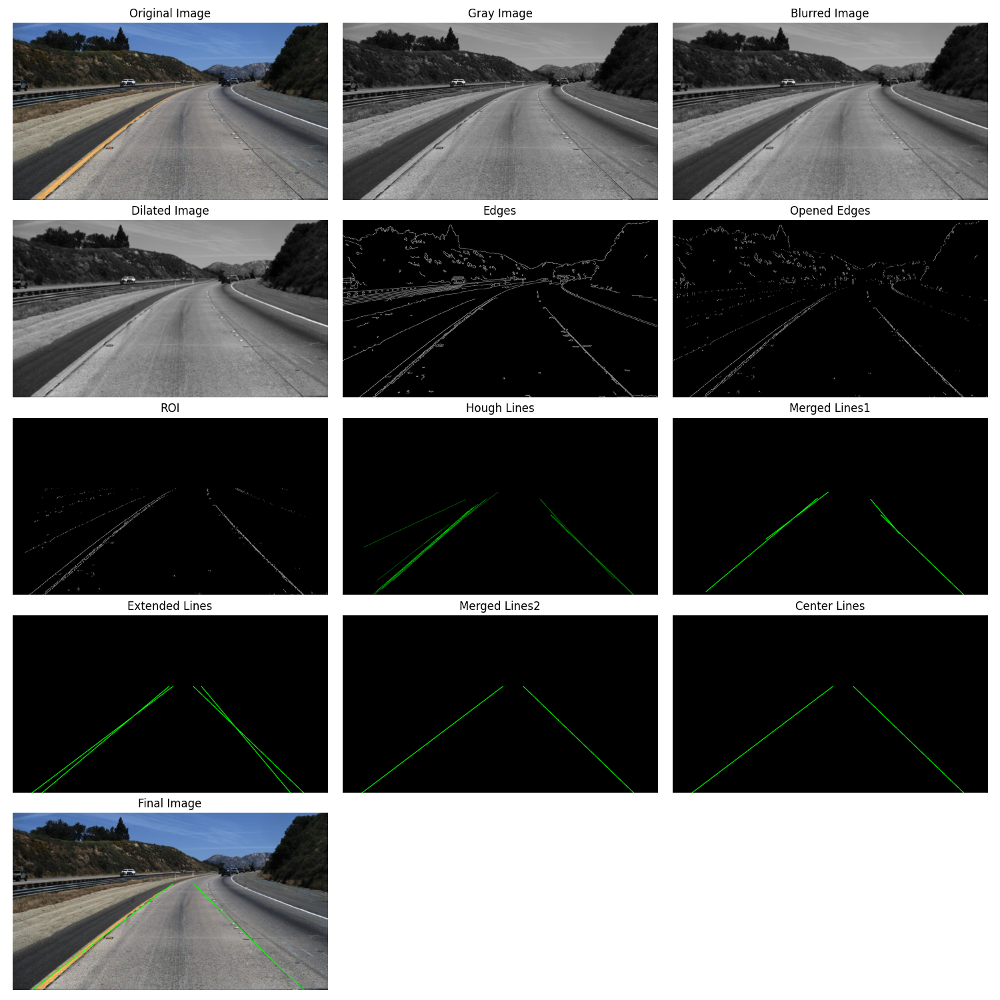
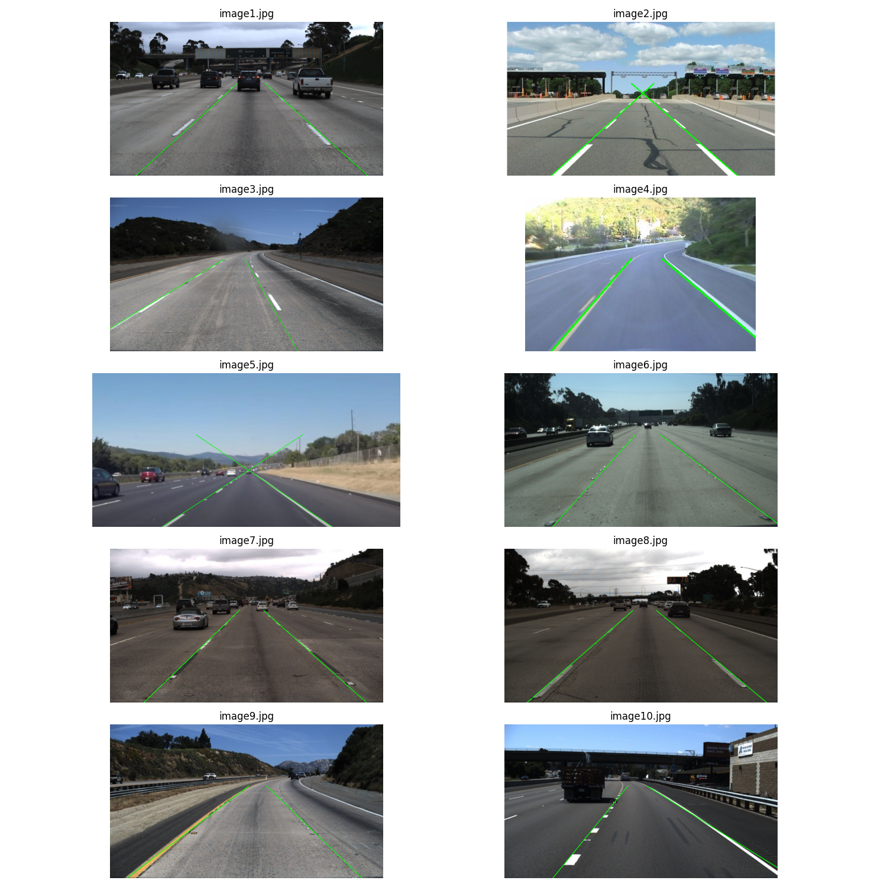

# Lane Detection Using OpenCV

This project implements a lane detection algorithm using computer vision techniques. It processes images of roads to identify and highlight lane markings, which is a crucial component in autonomous driving systems and advanced driver assistance systems (ADAS). The project utilizes OpenCV and various image processing techniques to achieve this.

## Features

- Image preprocessing (grayscale conversion, Gaussian blur, morphological operations)
- Edge detection using Canny edge detector
- Region of interest (ROI) selection
- Hough line transformation for line detection
- Line merging and extension algorithms
- Center line consideration for final lane marking

## Dependencies

The project requires the following Python libraries:

- OpenCV (cv2)
- NumPy
- Matplotlib
- Pandas

You can install these dependencies using pip:

```
pip install opencv-python pandas numpy matplotlib
```

## Usage

The main pipeline function `pipeline(image_path)` processes an input image through various stages of the lane detection algorithm. 

The `display_pipeline(image_path)` function shows the output of each stage in the pipeline for a given input image.

It can used as follows:

```python
display_pipeline("path/to/your/image.jpg")
```

Example output of `display_pipeline(image_path)` function on a test image:



## Pipeline Stages

1. Load image
2. Convert to grayscale
3. Apply Gaussian blur
4. Apply morphological dilation
5. Detect edges using Canny edge detector
6. Apply morphological opening
7. Apply region of interest mask
8. Detect lines using Hough transform
9. Merge similar lines
10. Extend detected lines
11. Consider center lines
12. Draw final lane markings on the original image

## Results on Different Images

Following are the results of the lane detection algorithm on different test images:

